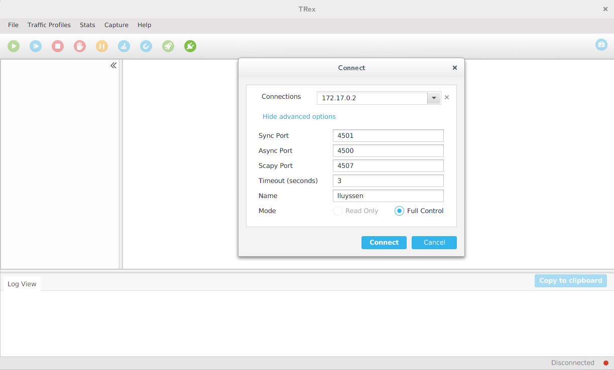

# Trex Gui Client
>It's a container for the Trex Gui part, you can manage your TrexServ from this module and show differents graph of the flux.



## Installation

Linux:

```sh
	docker build -t trex_gui .
	docker run -v /tmp/.X11-unix:/tmp/.X11-unix -e DISPLAY=unix$DISPLAY trex_gui:latest
```

## Explication of the DockerFile

Update and Upgrade ==> Basic <br />
Add Webupd8 repository ==> Installe the Personal Package Archive for Oracle Java JDK 8 par webupd8 <br />
Install Addictional Pack ==> Installe  graphics package <br />
Install Java ==> Install Orcale Java 8 <br />
Clean Up ==> Clean java file <br />
CMD => Start command for execute the gui <br />
TresGui Part ==> Clone and add différent files for Trex fonctionnement <br />

## Release History

* 0.1.2
    * Create the Reame.md
* 0.1.1
    * Adding sfr.yaml
    * Adding imix.yaml
* 0.1.0
    * Create the DockerFile
* 0.0.1
    * Work in progress

## Meta

1. Fork it (<https://github.com/Lluyssen/TrexDockerImplementation>)
2. Form (<https://github.com/cisco-system-traffic-generator>)
2. Form (<https://github.com/cisco-system-traffic-generator/trex-stateless-gui>)