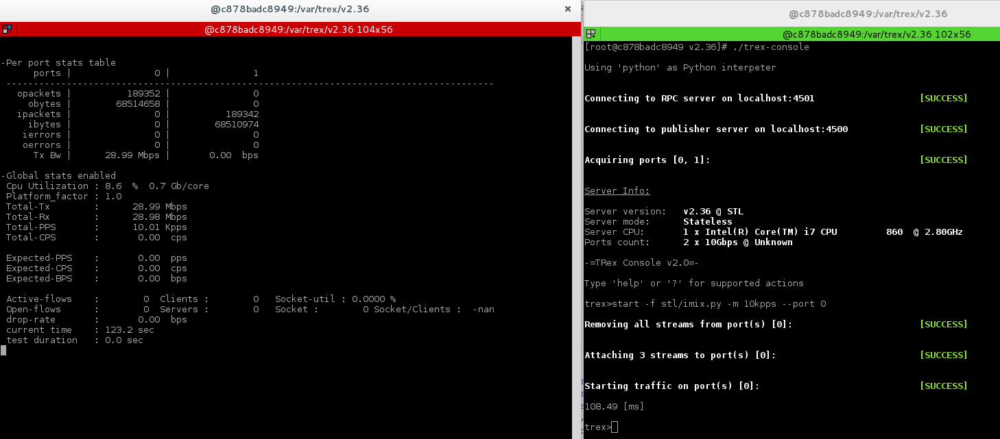

# Trex Server
>It's a container and the explication for the Trex Server part, you can manage your TrexServ from this module and show differents graph of the flux.



## Installation

Linux:

```sh
	B> docker pull trexcisco/trex:2.36
	B> docker run --rm -it --privileged --cap-add=ALL -p 4507:4507 -p 4501:4501 -p 4500:4500 trexcisco/trex:2.36
	C> ./t-rex-64 -i
```

## Explication

B> : Bash command <br />
C> : Container command <br />

1) pull the Trex Docker <br />
2) Run the Trex image with bash and allocate the différent port for Docker Gui Connexion <br />
3) Start the server with the interactive option <br />

> If you don't use the Trex Gui, you can manage your serv. For this open a new term in the same computer and do this

```sh
	B> docker exec -it 'Container ID' bash
	C> ./tex-console
	T> start -f stl/imix.py -m 10kpps --port 0
	T> tui
```

## Explication

B> : Bash command <br />
C> : Container command <br />
T> : Trex command <br />

1) exec the container with bash <br />
2) start the trex-console1 <br /> 
3) start the imix script on the serv <br />
4) show the stats of the serv <br />

## Meta

1. Fork it (<https://github.com/Lluyssen/TrexDockerImplementation>)
2. Form (<https://github.com/cisco-system-traffic-generator>)